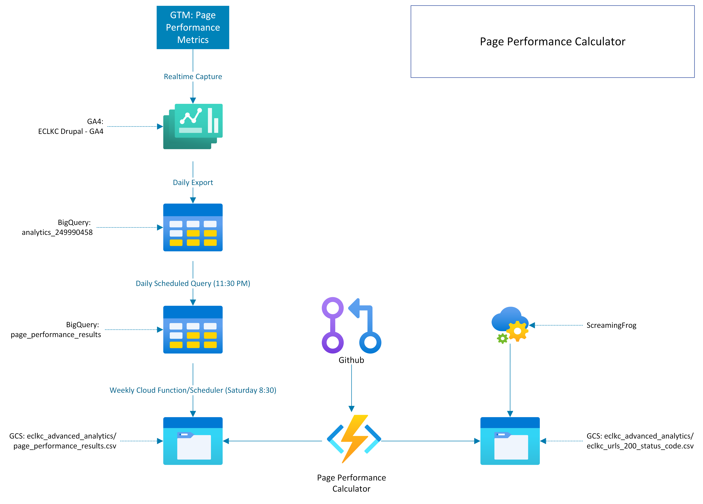

# Page Performance Command Line Script

## Overview/Summary

The Web Team goal is to develop consistent reporting toward reducing or maintaining the 1) Avg Page Load and 2) Avg Server Response Time for the ECLKC system when weighted by Pageview Counts over a well understood time period.  Doing so requires that we monitor, understand and control overall site metrics, metrics for collections of URLs, as well as individual page outliers for the Avg Page Load and Avg Server Response time.

The Page Performance Calculator addresses these needs and generates a report based on the specifications developed by the Web Team. Users can run this program in the command line and it provides arguments to customize the periods of interest and how the program performs its analysis. See below for details on how to install and run the program



## Installation Process and Running the Program

1. Create a local directory/folder for project files
2. Download/copy 'requirements.txt' and 'page_performance_calculator.py' files from 'page-performance' Github repository into directory
3. Request Google Cloud Service Account .json file and move into directory
4. Open a terminal/command line and change directories to the one created for this project
5. Run the package installer command below to install the dependencies via pip
6. Run the script using the basic sample below or read the command line information section for all of the optional arguments


### Installing Required Packages
```
pip install -r ./requirements.txt
```

### Running the script

The current command line arguments require the starting date of both the previous and current timeframe. Optional arguments exist for user customization

Base sample command line utilizing GCS for raw dataset and active URLs
```Shell
python ./page_performance_calculator.py -p 20230309 -c 20230330
```

Base sample command line with local copies of GCS files in same directory
```Shell
python ./page_performance_calculator.py -p 20230309 -c 20230330 -i "./page_performance_results.csv" -a "./eclkc_urls_200_status_code.csv"
```

Base sample command line with raw datasets written out. *Note to include file extensions with flags like -rd*
```Shell
python ./page_performance_calculator.py -p 20230309 -c 20230330 -rd "./raw_datasets_20230309-20230330.xlsx"
```

## Command Line Information

Command Line Arguments
```
-h, --help            show this help message and exit

Required Arguments:
-p previousdate, --previous_start_date previousdate
                        String representation for the start date of the previous timeframe as (yyyymmdd) format
-c currentdate, --current_start_date currentdate
                        String representation for the start date of the current timeframe as (yyyymmdd) format

Optional Arguments:
-tf [timeframe], --time_frame [timeframe]
                        Optionally specify the window of time for each dataset. Default is two weeks (14 days inclusive of start date)
-i [inputfile], --input_file [inputfile]
                        Override default file found on Box with a user specified dataset
-o [outputfile], --output_file [outputfile]
                        Override default output path of current directory to user specified destination
-a [activeurlfile], --active_urls_file [activeurlfile]
                        Override default file found on Box with a user specified active URLs dataset
-rd [rawdatasets], --raw_datasets [rawdatasets]
                        If a path is specified, will write out the two raw datasets to a seperate file for inspection

```

## Future Enhancements

- [x] Stylize Excel Export
- [ ] Determine if further threshold filtering is needed
- [ ] ECLKC API for Active URLs instead of GCS file
- [ ] Dockerize program?